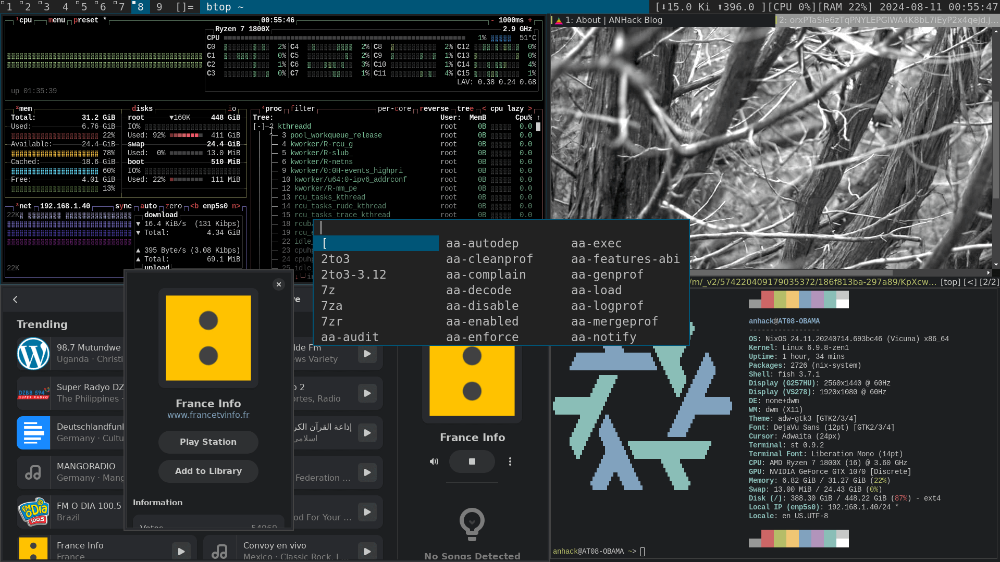
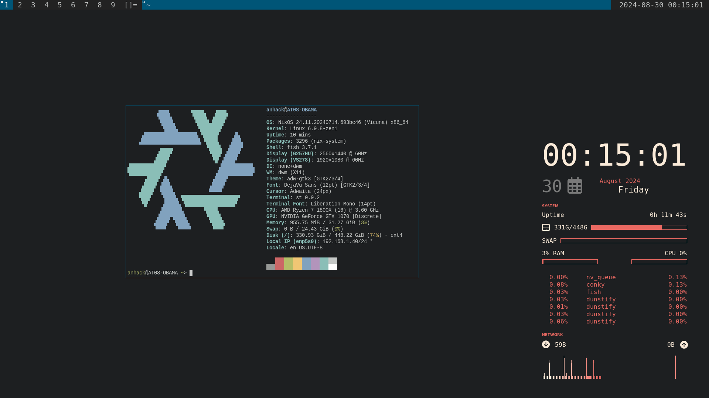

# ANHACK's Nixos Config

originally based on [xnm1's config](https://github.com/XNM1/linux-nixos-hyprland-config-dotfiles)

- WM: dwm
- Bar: slstatus

## Screenshots





| | |
| - | - |
| modified modules go in | `hosts` |
| anything having to do with the filesystem goes in | `home-manager:hosts` |
| and same thing goes for the user; if its user specific it goes in | `users:user` or `home-manager:users:user` |

and so we have a *mostly* mirrored desktop for any and all devices i want

## Structure
```
. {tree as of 2024-10-09}
├── LICENSE
├── README.md
├── flake.lock
├── flake.nix
├── home-manager
│   ├── hosts
│   │   ├── AT08-OBAMA
│   │   │   └── ...
│   │   └── AT20-CLEVELAND
│   │       └── ...
│   ├── modules
│   │   └── ...
│   └── users
│       └── anhack
├── hosts
│   ├── AT08-OBAMA
│   │   ├── configuration.nix
│   │   ├── default.nix
│   │   ├── display-setup.nix
│   │   ├── hardware-configuration.nix
│   │   └── modules
│   │       └── ...
│   └── AT20-CLEVELAND
│       ├── configuration.nix
│       ├── default.nix
│       ├── display-setup.nix
│       ├── hardware-configuration.nix
│       └── modules
│           └── ...
├── modules
│   ├── base
│   ├── system
│   ├── hardware
│   ├── editors
│   ├── development
│   └── desktop
│       ├── ...
│       └── targets
│           ├── dwm-desktop
│           ├── gnome-desktop
│           ├── hyprland-desktop
│           └── kde-desktop
├── users
│   └── anhack
└── wallpapers
    └── background_black.png
```

## More info
(ps) i could not recomend trying to run this config without heavy modification

but if you do here are some things to keep in mind:

1. main user is `anhack`
so change that name everywhere; just make sure it matches the primary user when you installed nixos.

1. if you don't replace `hardware-configuration.nix` in the `hosts` section
then you will not be able to load nixos because it will try to use the wrong drives.
i have messed that up myself a few times

in the `nixos-config` directory run `sudo nixos-rebuild switch --flake .#<HOST>` e.g. `sudo nixos-rebuild switch --flake .#AT08-OBAMA`

i've had a few systemd targets fail when installing everything. rerunning the command overcame the error

oh and set the default channel. fish auto compleations don't work without

`sudo nix-channel --update nixos`
